# Configuring Dual Subnets in pfSense (WindowsMachines & LinuxMachines)

Building on the [pfSense virtualized firewall setup](https://github.com/TannerHollaway/PFsenseSetup), this lab extends the environment by creating two isolated subnets — one for Windows VMs and one for Linux VMs — both routed and managed by pfSense.

## Objective

The goal of this lab was to expand the existing pfSense firewall into a segmented network environment with two distinct subnets. Any VM assigned to the `LinuxMachines` Internal Network in VirtualBox automatically receives a 192.168.2.x IP. Any VM assigned to `WindowsMachines` automatically receives a 192.168.3.x IP. pfSense handles all routing, DHCP, and firewall enforcement between the two subnets with no manual configuration required on individual VMs.

## Utilities Used

- **pfSense CE 2.8.1** — Firewall/router managing both subnets
- **VirtualBox** — Hypervisor hosting all VMs
- **Kali Linux** — Placed on the LinuxMachines subnet to verify connectivity
- **Windows 11** — Placed on the WindowsMachines subnet to verify connectivity

## Final Network Layout

| Interface | Adapter | VirtualBox Network | Subnet          | Role            |
|-----------|---------|--------------------|-----------------|-----------------|
| WAN       | em0     | Bridged            | Home network    | Uplink          |
| LAN       | em1     | LinuxMachines      | 192.168.2.0/24  | Linux VMs       |
| OPT1      | em2     | WindowsMachines    | 192.168.3.0/24  | Windows VMs     |

---

## Troubleshooting During Setup

**Issue 1: Adapter 3 missing adapter type**

When adding the third NIC to pfSense in VirtualBox, the Adapter Type field was left at default. This was caught before booting and corrected to **Intel PRO/1000 MT Desktop** to match Adapter 2 and avoid NIC detection issues in pfSense.

[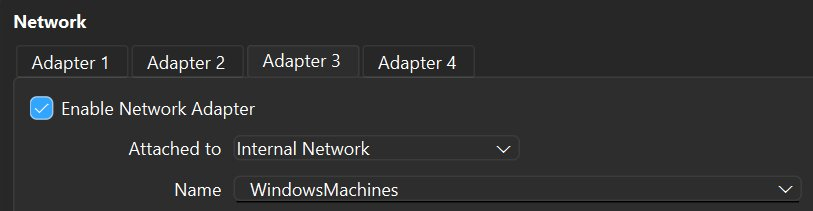](screenshots/adapter3-windowsmachines-config.png)
[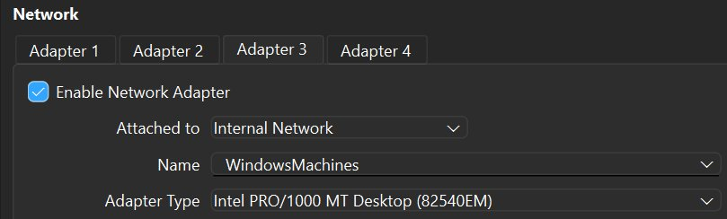](screenshots/adapter3-intel-nic-fix.png)

---

**Issue 2: VLAN approach attempted and abandoned**

The initial plan was to use pfSense's native VLAN support on a single trunk interface (em1), creating VLAN sub-interfaces em1.10 (LinuxMachines) and em1.20 (WindowsMachines) — avoiding the need for a third NIC entirely.

VLANs were configured in the pfSense console (option `1`, `y` to VLANs, em1 as parent interface, VLAN tags 10 and 20):

[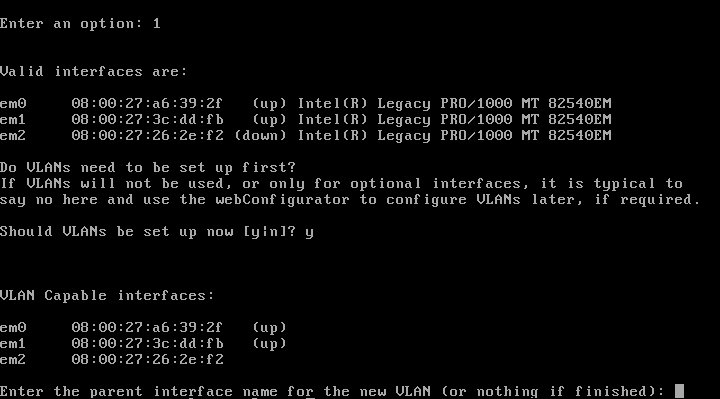](screenshots/vlan-setup-console.png)
[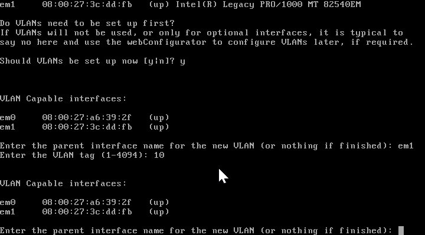](screenshots/vlan-10-20-creation.png)

Interfaces were assigned as WAN→em0, LAN→em1.10, OPT1→em1.20:

[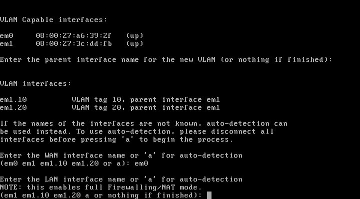](screenshots/vlan-interface-assignment.png)
[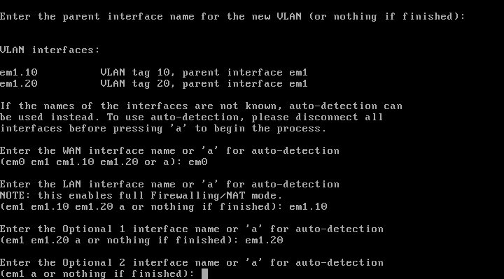](screenshots/vlan-assignment-opt2-skip.png)
[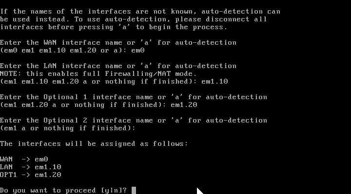](screenshots/vlan-assignment-confirm.png)
[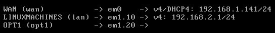](screenshots/interface-assignment-confirmed.png)

OPT1 was configured in the web GUI and renamed to WindowsMachines with a static IP of 192.168.3.1/24, and DHCP was enabled on both interfaces:

[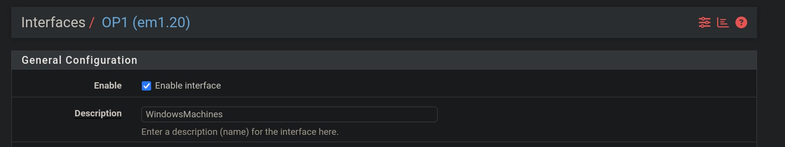](screenshots/opt1-windowsmachines-renamed.png)
[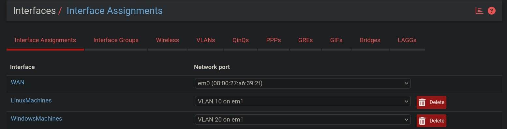](screenshots/interface-assignments-gui.png)
[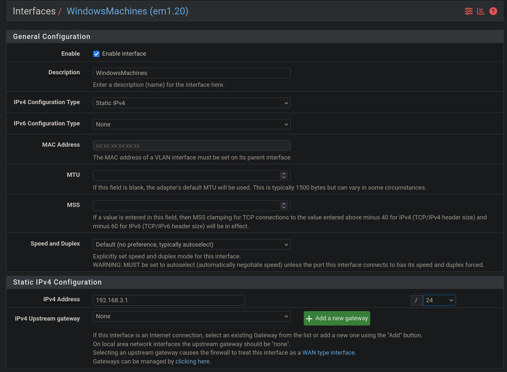](screenshots/windowsmachines-static-ip.png)
[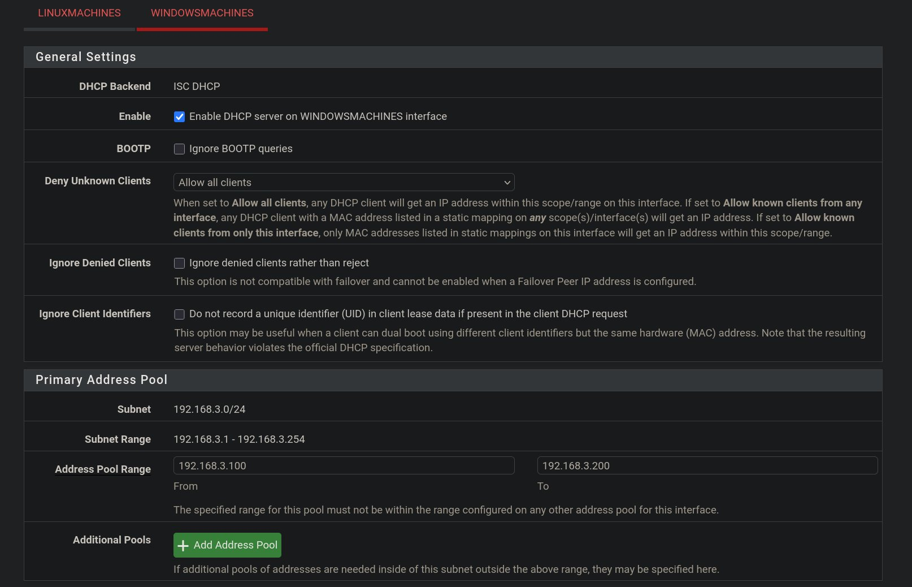](screenshots/windowsmachines-dhcp-config.png)

**Problem — Kali received no IP:** After the VLAN config, Kali had no IPv4 address and could not reach the pfSense web GUI.

[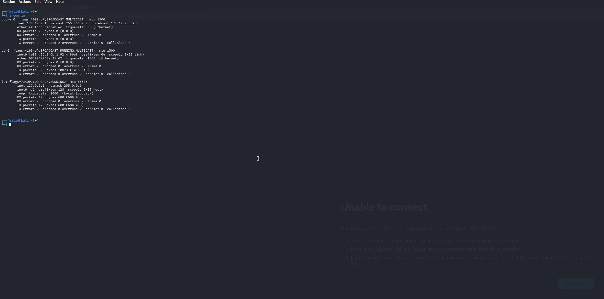](screenshots/kali-untagged-vlan-issue.png)

**Root cause:** VirtualBox Internal Networks act as dumb switches with no VLAN awareness. Once pfSense's em1 became a trunk interface, it expected tagged frames. VirtualBox sends untagged frames, so pfSense could not assign them to a VLAN. On a real network, a managed switch handles tagging per port automatically — VirtualBox cannot replicate this behavior.

**Workaround for Kali:** A VLAN sub-interface was manually created on Kali to tag its outbound traffic with VLAN ID 10:

```bash
sudo ip link add link eth0 name eth0.10 type vlan id 10
sudo ip link set eth0.10 up
sudo dhcpcd eth0.10
```

This worked for Kali. However, the Windows VM could not be tagged. VirtualBox's emulated Intel PRO/1000 MT Desktop adapter strips VLAN tags in hardware, and Windows has no native method to re-apply them without third-party drivers. Since the goal was for all VMs to receive correct IPs automatically with zero per-machine configuration, the VLAN approach was abandoned entirely in favor of separate Internal Networks.

---

**Issue 3: em2 not detected on first reassignment attempt**

After deciding to move to separate Internal Networks, pfSense's interface reassignment (option `1`, `n` to VLANs) did not list em2 as an available interface. A reboot of the pfSense VM resolved the issue and em2 appeared on the next attempt.

---

**Issue 4: Windows VM could not ping its gateway after receiving an IP**

After switching to separate Internal Networks, the Windows VM received 192.168.3.101 correctly but pings to 192.168.3.1 timed out with 100% packet loss. Kali had no such issue.

**Root cause:** pfSense automatically creates a default allow-all firewall rule for the LAN interface but does not do the same for OPT interfaces. The WindowsMachines (OPT1) interface had no rule permitting outbound traffic.

**Fix:** A pass rule was added under **Firewall → Rules → WindowsMachines**:

- **Action:** Pass
- **Interface:** WindowsMachines
- **Protocol:** Any
- **Source:** WindowsMachines subnets
- **Destination:** Any

[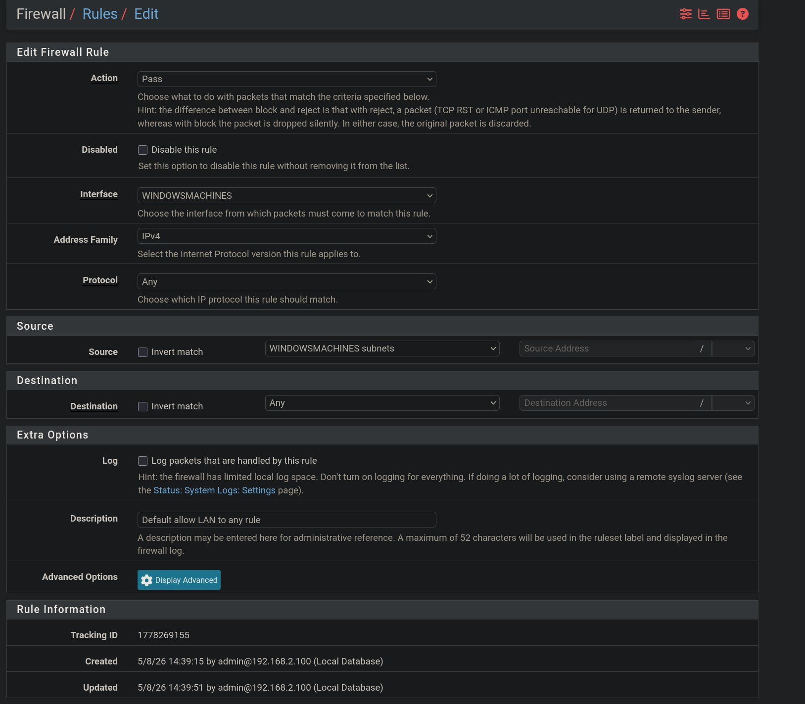](screenshots/windowsmachines-firewall-rule.png)

---

## VirtualBox Network Configuration

With pfSense powered off, the network adapters were configured as follows:

- **Adapter 1** → Bridged (WAN, home network uplink)
- **Adapter 2** → Internal Network → `LinuxMachines` — Intel PRO/1000 MT Desktop
- **Adapter 3** → Internal Network → `WindowsMachines` — Intel PRO/1000 MT Desktop

Linux VMs are connected to the `LinuxMachines` Internal Network in VirtualBox. Windows VMs are connected to the `WindowsMachines` Internal Network.

[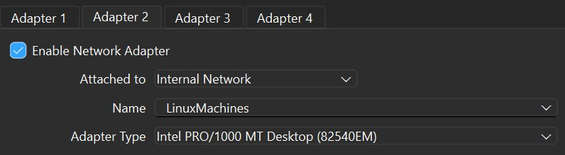](screenshots/adapter2-linuxmachines-config.png)
[](screenshots/adapter3-intel-nic-fix.png)

---

## Assigning Interfaces in pfSense

After booting pfSense, option `1` (Assign Interfaces) was selected from the console. When asked about VLANs, `n` was entered. Interfaces were assigned:

- **WAN** → em0
- **LAN** → em1
- **OPT1** → em2

*(screenshot)*

---

## Configuring Interfaces in the Web GUI

Each interface was configured under **Interfaces** in the pfSense web GUI at `http://192.168.2.1`:

**LAN → LinuxMachines**
- **Description:** LinuxMachines
- **IPv4 Configuration:** Static
- **IP Address:** 192.168.2.1 / 24

**OPT1 → WindowsMachines**
- **Enabled:** Yes
- **Description:** WindowsMachines
- **IPv4 Configuration:** Static
- **IP Address:** 192.168.3.1 / 24

*(screenshot)*

---

## Enabling DHCP on Both Subnets

DHCP was enabled for each subnet under **Services → DHCP Server**:

- **LinuxMachines:** 192.168.2.100 – 192.168.2.200
- **WindowsMachines:** 192.168.3.100 – 192.168.3.200

*(screenshot)*

---

## Verifying Connectivity

Both VMs were assigned to their respective Internal Networks in VirtualBox and confirmed connectivity to their pfSense gateways automatically — no manual IP configuration needed on either machine.

**Kali Linux (LinuxMachines — 192.168.2.x)**
- `ifconfig` confirmed IP: 192.168.2.100
- Ping to 192.168.2.1 → 0% packet loss ✓

**Windows VM (WindowsMachines — 192.168.3.x)**
- `ipconfig` confirmed IP: 192.168.3.101
- Ping to 192.168.3.1 → 0% packet loss ✓

[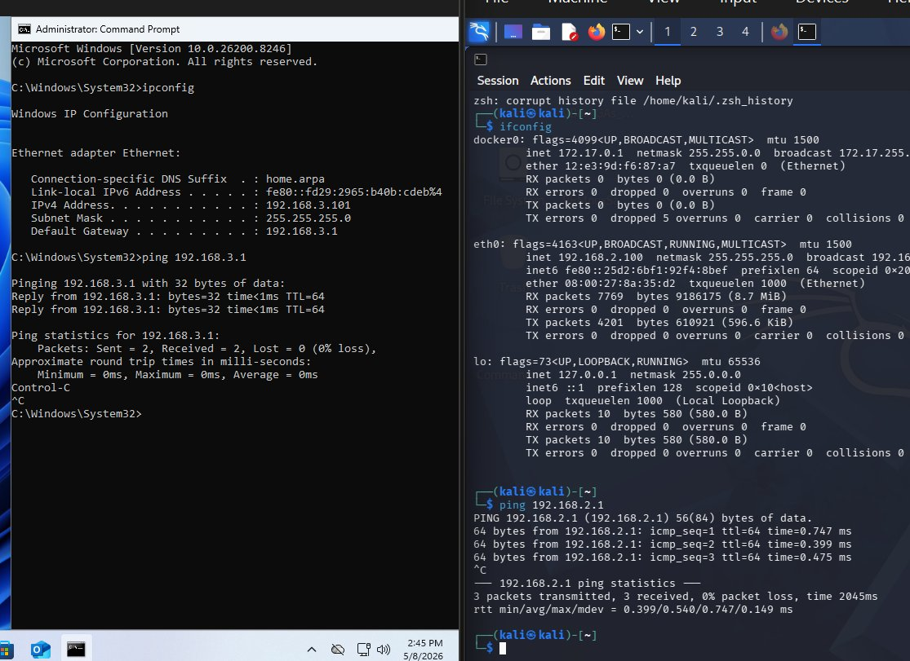](screenshots/connectivity-verified.png)

---

## Closing

Both subnets were successfully deployed and verified. pfSense routes traffic from two isolated internal networks — `LinuxMachines` (192.168.2.0/24) and `WindowsMachines` (192.168.3.0/24) — through a single bridged WAN uplink to the home network. Any VM placed on the correct Internal Network in VirtualBox receives the appropriate IP address automatically from pfSense's DHCP server with no manual configuration required on the VM itself. This environment serves as the foundation for upcoming labs focused on firewall rule enforcement and inter-subnet traffic analysis.
